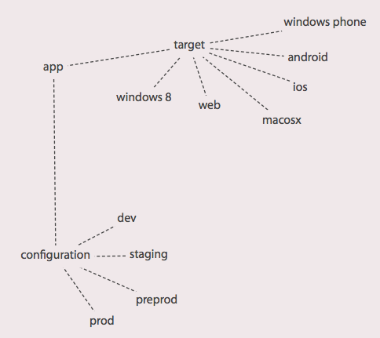

tarifa [](http://github.com/hughsk/stability-badges)
======

Opiniated workflow for cordova

### Goals

Handling all life cycle processes of a mobile app: create, build, publish, upgrade with a single cli

```
Usage: tarifa [command] [options]

command     
  create      create a mobile app
  prepare     prepare the app for building
  build       build the app with a given configuration for some targets
  run         run mobile app on attached devices
  upgrade     upgrade current project
  publish     publish mobile app
  info        current project information

Options:
   -v, --version   print version and exit
   -h, --help      print this text

Opinated workflow for cordova mobile apps with browserify and friends
```

### Context

A mobile app has many configuration and can be build for multiple targets.



Building to publish or the run


