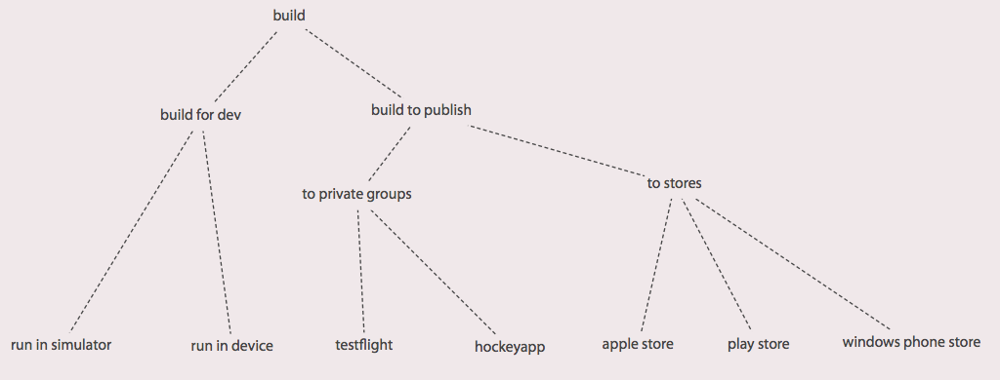

tarifa
======

Opiniated workflow for cordova

Goals: Handling all life cycle processes of a mobile app: create, build, publish, upgrade with a single cli

Context: A mobile app has many configuration and can be build for multiple targets.

